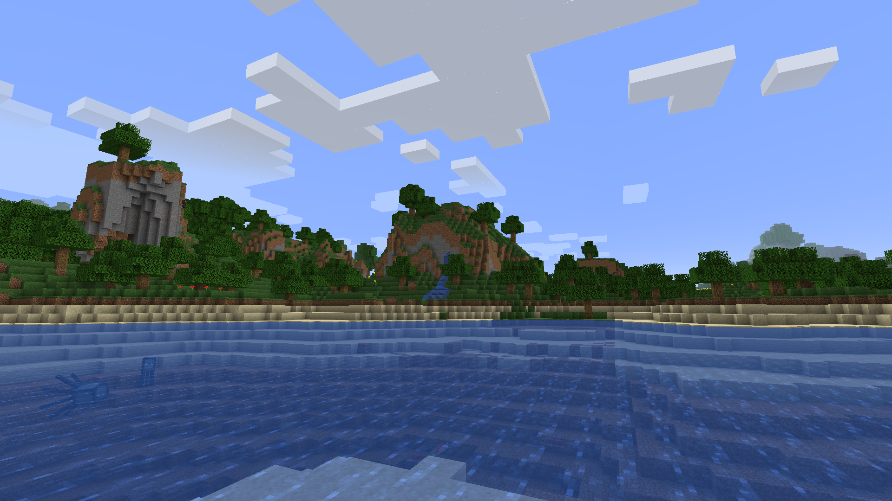
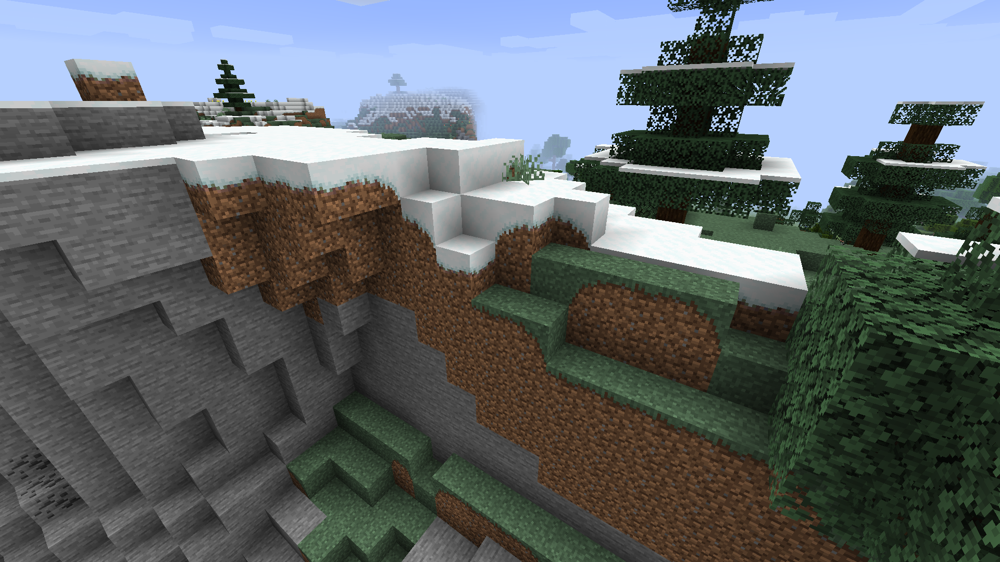
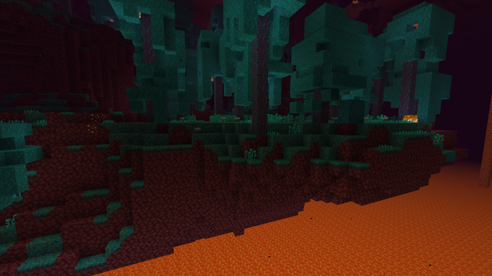
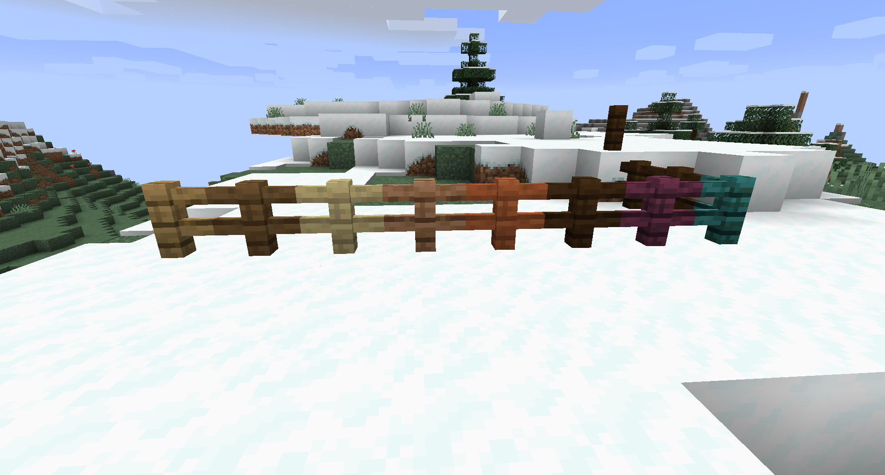
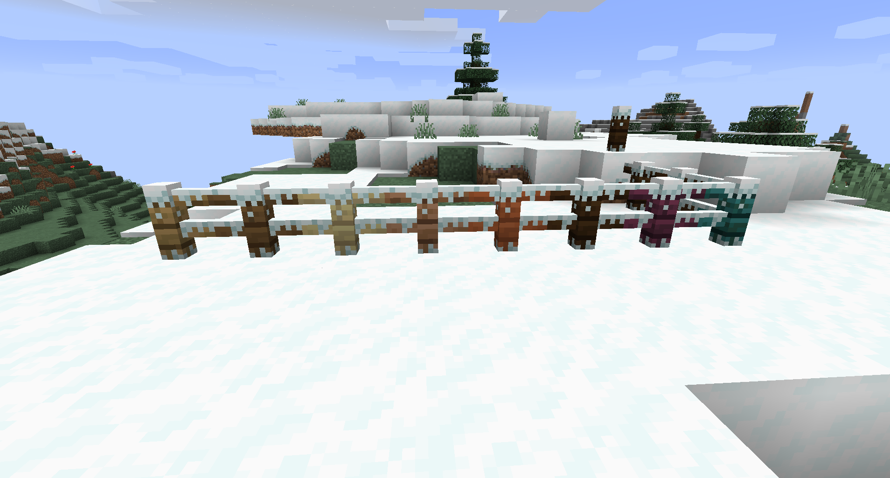
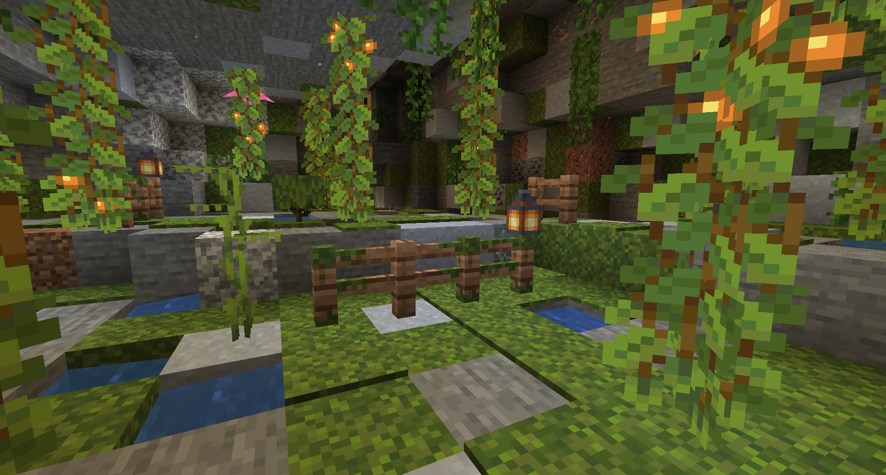
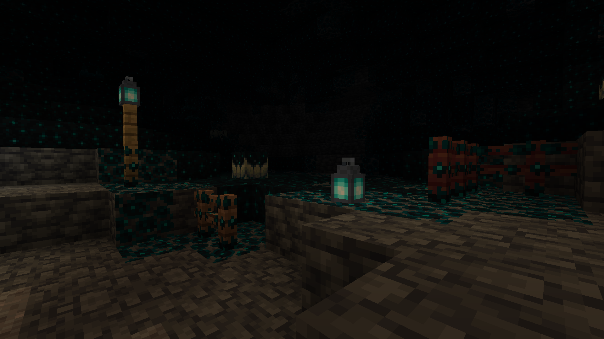
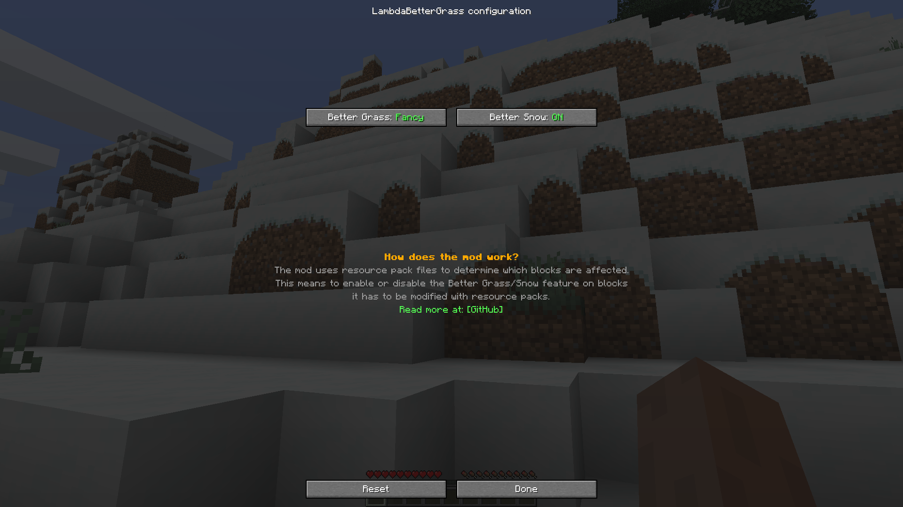

# LambdaBetterGrass

<!-- modrinth_exclude.start -->
 <!-- modrinth_exclude.end -->

[![Mod loader: Quilt]][quilt] <!-- modrinth_exclude.start -->

<!-- modrinth_exclude.end -->

An actual better grass and snow mod for Quilt.

## 📖 What's this mod?

Have you ever used the MCPatcher/OptiFine better grass feature?
I did, and I didn't like it at all.
The main issue is that it's too rough even at Fancy settings.
That's why I made my own mod to fix this issue and provide an alternative to one of the OptiFine features on the Fabric ecosystem!
Grass blocks will now connect, and the nearby grass blocks will be smoothed.

Better snow with the optional included resource pack:

Better "snow" with the optional included resource pack in lush caves (credits to cavebiomes by SuperCoder79):

Better "snow" system used for sculk vein, here with the optional included resource pack for custom fences:

Configuration screen:

Searching other mods to replace OptiFine? [Check out this list!](https://lambdaurora.dev/optifine_alternatives)

## ✅ Features:

- Connect grass blocks
- Connect mycelium blocks
- Connect podzol blocks
- Connect grass path blocks
- Connect crimson nylium blocks
- Connect warped nylium blocks
- Add snow layer to many non-full blocks when Better Snow is enabled
- Add moss layer to many non-full blocks when Better Snow is enabled
- Add an optional built-in resource pack to have snowy fences.
- API for resource pack creators and modders to add new block connection following the better grass rule or new alternate models for blocks following the better snow rule.
- And more!

## 📖 Usage

Using this mod is very simple!

Install it in your mods folder along with [Quilted Fabric API] and [ModMenu].

You will notice that some blocks like grass blocks will connect together, if you want to try other options or want to have the same look as OptiFine you can look into the settings screen of the mod via [ModMenu].

<!-- modrinth_exclude.start -->
### Build

Just do `./gradlew shadowRemapJar` and everything should build just fine!
<!-- modrinth_exclude.end -->

### For resource packs creators and developers

Please check out [this documentation](https://lambdaurora.dev/projects/lambdabettergrass/documentation/).

## 📖 Compatibility

- [Sodium] is compatible only with [Indium] present.
- Canvas is compatible.
- ConnectedBlockTextures is compatible.
- Continuity is compatible.
- OptiFabric is obviously incompatible.

<!-- modrinth_exclude.long_start -->
## Downloads

<a href="https://modrinth.com/mod/lambdabettergrass" style="display: inline-flex; align-items: center;">
<svg aria-hidden="true" viewBox="16 -2 150 150" data-view-component="true" width="42" height="42"><path fill-rule="evenodd" fill="#1bd96a" d="M159.07,89.29A70.94,70.94,0,1,0,20,63.52H32A58.78,58.78,0,0,1,145.23,49.93l-11.66,3.12a46.54,46.54,0,0,0-29-26.52l-2.15,12.13a34.31,34.31,0,0,1,2.77,63.26l3.19,11.9a46.52,46.52,0,0,0,28.33-49l11.62-3.1A57.94,57.94,0,0,1,147.27,85Z"></path><path fill-rule="evenodd" fill="#1bd96a" d="M108.92,139.3A70.93,70.93,0,0,1,19.79,76h12a59.48,59.48,0,0,0,1.78,9.91,58.73,58.73,0,0,0,3.63,9.91l10.68-6.41a46.58,46.58,0,0,1,44.72-65L90.43,36.54A34.38,34.38,0,0,0,57.36,79.75C57.67,80.88,58,82,58.43,83l13.66-8.19L68,63.93l12.9-13.25,16.31-3.51L101.9,53l-7.52,7.61-6.55,2.06-4.69,4.82,2.3,6.38s4.64,4.94,4.65,4.94l6.57-1.74,4.67-5.13,10.2-3.24,3,6.84L104.05,88.43,86.41,94l-7.92-8.81L64.7,93.48a34.44,34.44,0,0,0,28.72,11.59L96.61,117A46.6,46.6,0,0,1,54.13,99.83l-10.64,6.38a58.81,58.81,0,0,0,99.6-9.77l11.8,4.29A70.77,70.77,0,0,1,108.92,139.3Z"></path></svg>

Modrinth
</a>

<a href="https://www.curseforge.com/minecraft/mc-mods/lambdabettergrass" style="display: inline-flex; align-items: center">
<svg aria-hidden="true" viewBox="-2017 853 43 23" data-view-component="true" src="https://www.curseforge.com/Content/2-0-8083-18015/Skins/CurseForge/images/anvil.svg" width="42" height="42" style="fill: var(--ls_theme_primary)"><path fill-rule="evenodd" d="M-2005.7,853l0.7,3c-3.5,0-12,0-12,0s0.2,0.9,0.3,1c0.3,0.5,0.6,1.1,1,1.5c1.9,2.2,5.2,3.1,7.9,3.6  c1.9,0.4,3.8,0.5,5.7,0.6l2.2,5.9h1.2l0.7,1.9h-1l-1.7,5.5h16.7l-1.7-5.5h-1l0.7-1.9h1.2c0,0,1-6.1,4.1-8.9c3-2.8,6.7-3.2,6.7-3.2  V853H-2005.7z M-1988.9,868.1c-0.8,0.5-1.7,0.5-2.3,0.9c-0.4,0.2-0.6,0.8-0.6,0.8c-0.4-0.9-0.9-1.2-1.5-1.4  c-0.6-0.2-1.7-0.1-3.2-1.4c-1-0.9-1.1-2.1-1-2.7v-0.1c0-0.1,0-0.1,0-0.2s0-0.2,0.1-0.3l0,0l0,0c0.2-0.6,0.7-1.2,1.7-1.6  c0,0-0.7,1,0,2c0.4,0.6,1.2,0.9,1.9,0.5c0.3-0.2,0.5-0.6,0.6-0.9c0.2-0.7,0.2-1.4-0.4-1.9c-0.9-0.8-1.1-1.9-0.5-2.6  c0,0,0.2,0.9,1.1,0.8c0.6,0,0.6-0.2,0.4-0.4c-0.1-0.3-1.4-2.2,0.5-3.6c0,0,1.2-0.8,2.6-0.7c-0.8,0.1-1.7,0.6-2,1.4c0,0,0,0,0,0.1  c-0.3,0.8-0.1,1.7,0.5,2.5c0.4,0.6,0.9,1.1,1.1,1.9c-0.3-0.1-0.5,0-0.7,0.2c-0.2,0.2-0.3,0.6-0.2,0.9c0.1,0.2,0.3,0.4,0.5,0.4  c0.1,0,0.1,0,0.2,0h0.1c0.3-0.1,0.5-0.5,0.4-0.8c0.2,0.2,0.3,0.7,0.2,1c0,0.3-0.2,0.6-0.3,0.8c-0.1,0.2-0.3,0.4-0.4,0.6  s-0.2,0.4-0.2,0.6c0,0.2,0,0.5,0.1,0.7c0.4,0.6,1.2,0,1.4-0.5c0.3-0.6,0.2-1.3-0.2-1.9c0,0,0.7,0.4,1.2,1.8  C-1987.4,866.2-1988.1,867.6-1988.9,868.1z"></path></svg>

CurseForge
</a>

<a href="https://github.com/LambdAurora/LambdaBetterGrass/releases" style="display: inline-flex; align-items: center">
<svg aria-hidden="true" viewBox="0 0 16 16" data-view-component="true" width="42" height="42" style="fill: var(--ls_theme_primary)"><path fill-rule="evenodd" d="M8 0C3.58 0 0 3.58 0 8c0 3.54 2.29 6.53 5.47 7.59.4.07.55-.17.55-.38 0-.19-.01-.82-.01-1.49-2.01.37-2.53-.49-2.69-.94-.09-.23-.48-.94-.82-1.13-.28-.15-.68-.52-.01-.53.63-.01 1.08.58 1.23.82.72 1.21 1.87.87 2.33.66.07-.52.28-.87.51-1.07-1.78-.2-3.64-.89-3.64-3.95 0-.87.31-1.59.82-2.15-.08-.2-.36-1.02.08-2.12 0 0 .67-.21 2.2.82.64-.18 1.32-.27 2-.27.68 0 1.36.09 2 .27 1.53-1.04 2.2-.82 2.2-.82.44 1.1.16 1.92.08 2.12.51.56.82 1.27.82 2.15 0 3.07-1.87 3.75-3.65 3.95.29.25.54.73.54 1.48 0 1.07-.01 1.93-.01 2.2 0 .21.15.46.55.38A8.013 8.013 0 0016 8c0-4.42-3.58-8-8-8z"></path></svg>

GitHub
</a>

<!-- modrinth_exclude.long_end -->

[quilt]: https://quiltmc.org
[Mod loader: Quilt]: https://img.shields.io/badge/modloader-Quilt-9115ff?style=flat-square
[Quilted Fabric API]: https://modrinth.com/mod/qsl "Quilted Fabric API Modrinth page"
[ModMenu]: https://modrinth.com/mod/modmenu "ModMenu Modrinth page"
[Sodium]: https://modrinth.com/mod/sodium "Sodium Modrinth page"
[Indium]: https://modrinth.com/mod/indium "Indium Modrinth page"
